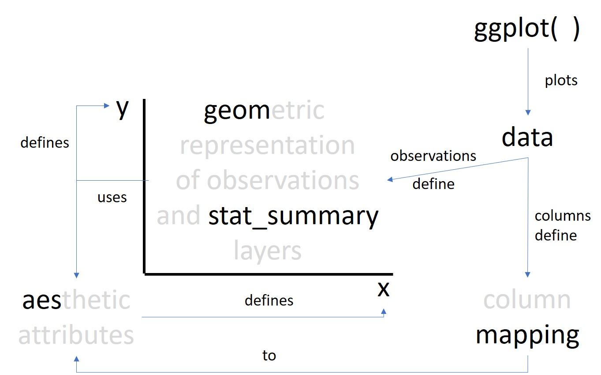
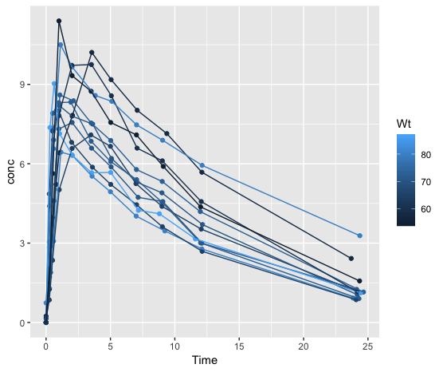

```{r setup, include=FALSE}
knitr::opts_chunk$set(echo = TRUE, eval = FALSE)
library(tidyverse)
source("Setup.R")
```

## Before we get started
Within my domain (pharmacometrics) the most typical plot we see is time-course of 
some biological measurement e.g. plasma concentration of some drug within 
subjects. So the aim of this lesson is to get up to speed quickly with plotting
this kind of data.

Follow the instructions in this .Rmd file and fill in the blank spaces in the R 
chunks, then run the chunk using the green arrow button or CTRL/CMD + ENTER.

Once you have completed all the chunks you can render the output as HTML or PDF
using the "knit" button / drop down menu.

If you get stuck, please give me a shout on Twitter: @MikeKSmith. Alternatively
I have an account at the RStudio Community https://community.rstudio.com/ 
@MikeKSmith; and I'm on the R4DS Slack Channel at "Mike K Smith"

## Learning objective of this lesson
By the end of this lesson you will be able to use the `ggplot2` package to
create graphs of continuous outcomes over time, identifying individual subject
data within that graph (spaghetti plots), adding a line for the median over time,
annotating with titles and labels to axes and saving the final plot to a file.

## Getting help with ggplot2
There are three places that I go to, to get help with `ggplot2`:  
  
  * https://r4ds.had.co.nz/data-visualisation.html.   
  * https://ggplot2.tidyverse.org/index.html .  
  * The ggplot2 cheatsheet: 
https://github.com/rstudio/cheatsheets/blob/master/data-visualization-2.1.pdf  
  

## ggplot2 Concepts

We're going to look at how `ggplot2` combines column variables in the data
to define x and y axes through aesthetic mappings, and how the `geom` 
functions represent these mapped variables using geometric representation of
observations (points, lines, etc.) on the plot. We'll revisit this graphic 
at the end of the lesson once we've used these concepts in the examples below.

```{r, eval = TRUE, echo = FALSE}

```


## ggplot2 template

The `ggplot` function is used to start a "blank canvas" for a plot, to which we're 
going to add visualisation `geom`s to represent data in the dataset on the canvas.
The `mapping` argument maps ***data columns*** to ***plot attributes***
such as x and y axes, groupings, size, shape, colour etc. specified by a call to the
`aes` function. `ggplot` builds visualisations through combining layers using the
`+` operator. Use the `+` operator **at the end of the line** before specifying 
the next layer.

The starting template we'll work with looks like this:  
  
```
ggplot(data = ...) + 
  geom_...(mapping = aes(x =  ..., y =  ...,  ...  ))
```

The `mapping` argument takes a function `aes` which helps define the data columns
without having to using quotes for column names. It essentially forms a list
specifying how values in data columns will be represented in the plot, for 
example changing colour, size, shape using data variables, as well as location
of points and lines through x and y axes. We also see how to use the `group` attribute to
identify time series of data identified by distinct values of the grouping variable
in our case.

The `geom` you choose will depend on what type of data you want to visualise 
and plot.

In the example data below we will be plotting theophylline concentration
against the time after dosing measured in hours.

## First plot

Plot the Theophylline data (from the dataset `Theoph`) with `Time` on the x-axis 
and `conc` on the y axis. 
  
**YOUR TURN: Complete the code below to create a basic plot of concentration over
time**

**HINT:** Use the "Environment" window tools (using the data viewer icon or 
the command `str(Theoph)` on the console) to check variable names.

```{r}
ggplot(data = Theoph) +
  geom_point(mapping = aes(x =  , y =  ))
```

## Identify each subject's own data

***How could we identify data from each of the subjects?***
  
The `Theoph` dataset contains a column called `Subject` which has a new value for each
subject. We could use this to identify each subject's data on the plot. We do this
here by specifying that `colour` changes for each value of `Subject`.

```{r}
ggplot(data = Theoph) +
  geom_point(mapping = aes(x =  , y =   , colour =  ))
```

`ggplot2` automatically includes a legend and selects a colour palette to distinguish
values. It's possible to alter both of these through `ggplot2` functions and 
arguments specified in subsequent layers.

**QUESTION: How does ggplot know to create a legend and identify each subject's
data?**  

**HINT:** Use the "Environment" window blue arrow by the `Theoph` dataset
to inspect the `Subject` variable type, or type `str(Theoph)` on the 
console.

It might be better to link the data from each subject by joining it with a
line. 

```{r}
ggplot(data = Theoph ) +
  geom_point(mapping = aes(x = , y =  , colour = )) +
  geom_line(mapping = aes(x = , y =  , colour = ))
```

Notice how the mapping argument is largely repeated across both `geom` functions. 
This is a bit repetitious and also could be prone to mistakes if we make 
changes in one, but not the other. We can specify mappings in the `ggplot` 
call which then will be inherited by subsequent layers, unless they are 
explicitly changed. There is an argument in the `geom` functions called
`inherit.aes` which is by default `TRUE`. This is what allows us to pass
the `mapping` from the top level down to each `geom` layer.

```{r}
ggplot(data = Theoph, 
       mapping = aes(x =  , y =  , colour = )) +
  geom_point() +
  geom_line()
```

If we are only interested in the subject profiles across time and don't need
to change colour for each subject, we can use the `group` attribute in the 
`aes` to specify that we want separate lines for each distinct value of 
`Subject` in the data. This will give us black lines for each subject - our
familiar "spaghetti plot". 

Note that I'm putting the `group` into a mapping for `geom_line` rather 
than at the top level of the plot. This is because the grouping only applies
to the lines. It then means that only the `x` and `y` attributes are 
inherited to additional `geom`s - for example if we used `geom_smooth`. 

When you are creating your plots using `ggplot2` you might have to reorganise
your mapping statements a little depending on what `geoms` and layers you 
want to add to your plots. As a rule of thumb, remember that `ggplot` dictates
the most general mappping, and have more specific mappings for different `geom`s and 
layers as needed.

```{r}
ggplot(data = Theoph, 
       mapping = aes(x = Time , y = conc )) +
  geom_line(mapping = aes(group = Subject))
```

## Identify dose

**QUESTION: If we change colour for each value of `Dose` then instead
of individual values in the legend we get a shaded bar. Can you work out why?**
  
**HINT:** Have a look at the variables types of `Subject` and `Dose` in the 
dataset. Use `str(Theoph)` on the console and compare the different variable
types for `Subject` and `Dose`.

```{r}
ggplot(data = Theoph,
       mapping = aes(x = Time , y = conc , colour = Dose)) +
  geom_point() + 
  geom_line()
```

Can you see how at certain times the lines connect all points at that time? This is
because we've not specified which subject is which using the `group` attribute.
Recall that the `group` aesthetic will perform a separate action for each distinct 
value of that grouping variable. So we need to specify a `group` aesthetic using 
`Subject` to show lines for each value of `Subject`. 

**Assessment: How can we identify individual subject profiles for the `geom_line`?**
Copy and paste the bits of code in the grey code chunk below into the right places 
in order to get the plot to show different colours for each `Dose` but separate lines 
for each value of `Subject`. Keep running the `ggplot` section of code to check 
your graph. Remember that adding elements to the `mapping` statement will need
a comma between each element.

**CAUTION:** There may be more statements than you need! AND there may be
more than one correct answer.
  
```{r}
colour = Dose
group = Subject
group = Dose

mapping = aes(x = Time, y = conc)

mapping = aes(  )

ggplot(data = Theoph ) + 
  geom_point( ) + 
  geom_line( )
```

## Adding a summary
`ggplot2` also has useful functions for adding summaries of data. This is
a great feature since we don't have to calculate the median or other summary
statistic and figure out how to add that information to the plot. `ggplot2` 
will take care of that for us. We just choose the function and the `geom` to
go with it. `stat_summary` will inherit the mapping and grouping from `ggplot`
**unless** you respecify the `mapping` inside the function call, as before.

Note that here we're changing the x-axis for the summary to use the 
nominal times `nomTime`, rather than actual times post dose. This means 
that each subject has the same nominal sample times for the summary, rather 
than the observed sample times.

We've also added some transparency `alpha`
for the points so that they are de-emphasised. It's good practice to make sure 
that the main feature you want to show in the plot stands out. We can drop the 
`geom_point` since the lines convey as much information as we need to show 
the individual data.

```{r}
ggplot(data = Theoph, mapping = aes(x = Time, y = conc)) +
  geom_line(mapping = aes(group = Subject), alpha = 0.2) +
  stat_summary(mapping = aes(x = nomTime, y = conc), colour = "red", 
               fun.y = median, geom = "line")
```

**NOTE:** I have moved the `group` aesthetic mapping into the `geom_line` from the
`ggplot` function as I do not want the `stat_summary` to summarise by `Subject`.
Remember that you can override the `group` aesthetic in the `ggplot` function call 
by specifying `mapping = aes(group = NULL)` within `stat_summary` or `geom_smooth`. 

**NOTE:** The `stat_summary` argument `geom` must be in quotes. In specifying
a `geom` you can drop the "geom_" part.

**NOTE:** Most `geom` types only take **one** value, so typically, the function used in
`stat_summary` argument `fun.y` should return a single value. You can specify lower, 
midpoint and upper values by specifying `fun.data` and picking a suitable `geom`, 
for example `geom_errorbar`.

## Changing plot attributes
We can also tweak the plot title, subtitle, axes labels, axes types etc. through
ggplot layers. 

Plasma concentration of a drug is often reported on the log-scale, since the
concentrations can vary through different orders of magnitude. 

**YOUR TURN: Copy the code from the previous step and change the y-axis to the log-scale.**

**HINT:** Remember that you need a `+` at the ***END*** of the line before 
adding new layers.

```{r}
 plot1 <-   +
  scale_y_log10()
plot1
```


One of the beauties of `ggplot2` is that it's easy to change plot attributes
simply by adding or changing plot layers.

Now let's add some more informative labels via the `labs` layer:
```{r}
plot1 <- plot1 + 
  labs(title = "Plasma concentration of Theophylline following single dose",
       x = "Time (hrs)",
       y = "Concentration (ng/ml)")

plot1
```

Here we've assigned the plot to an R object which allows us to reference the plot
later when we want to tweak it. This makes it really easy to build up the plot
layer by layer and see exactly what we're adding or changing at each step
without having to go back to square one or having to copy and paste code.

If we're happy with the plot, we can save it to an image file using the 
`ggsave` function:

```{r}
ggsave(filename = "Theoph_conc_time.png", plot = plot1)
```

`ggsave` will save the plot with some reasonable settings, and avoids the need 
to open a graphics device and remember to close it at the end with `dev.off()`.

## Summary
  
  * We have looked at how the `ggplot` function maps data columns to plot attributes
  or `aes`thetics (axes, groupings, colour) through the `mapping` argument.  
  * How data observations are represented onto that "canvas" by specifying `geom` 
  representations.  
  * Different layers of information can be built up on the `ggplot` 
  object by adding these using the `+` operator.  
  * `stat_summary` functions allow us to add summary statistic points onto the plot
  using the `x`, `y` mappings.
  * The `labs` layer allows us to add titles, subtitles, captions and refine axes labels.
  * `ggsave` allows us to save the graph.
  * A basic template for `ggplot2` for continuous data outcomes is given below:
  
```
ggplot(data = ..., mapping = aes( x = ..., y = ... )) + 
  geom_point() +
  geom_line(mapping = aes( group = ... )) +
  stat_summary(colour = "red", 
               fun.y =  median , geom = "line" ) +
  labs(title = " ... ",
       x = " ... ",
       y = " ... ")
```

## ggplot2 Concepts (revisited)

```{r, eval = TRUE, echo = FALSE}

```

## Assessment
***QUESTION: Which piece of R code matches the image below:***
```{r, eval = TRUE, echo = FALSE}

```


a)  
  
```
ggplot(data = Theoph, 
       mapping = aes(x = Time, y = conc, colour = Wt)) + 
  geom_point() + 
  geom_line()
```

b)  
  
```
ggplot(data = Theoph, 
       mapping = aes(x = Time, y = conc, group = Subject, colour = Wt)) + 
  geom_point() + 
  geom_line()
```

c)  
  
```
ggplot(data = Theoph, 
       mapping = aes(x = Time, y = conc, group = Subject)) + 
  geom_point(colour = Wt) + 
  geom_line(colour = Wt)
```

d) 
  
```
ggplot(data = Theoph, 
       mapping = aes(x = Time, y = conc, group = Subject), colour = "Wt") + 
  geom_point() + 
  geom_line()
```
  
----
It's good to keep a record of the packages and versions that were used to create content.
You can get that easily using the `sessionInfo` function. This allows you and others to 
recreate this content in the future.
```{r}
sessionInfo()
```
